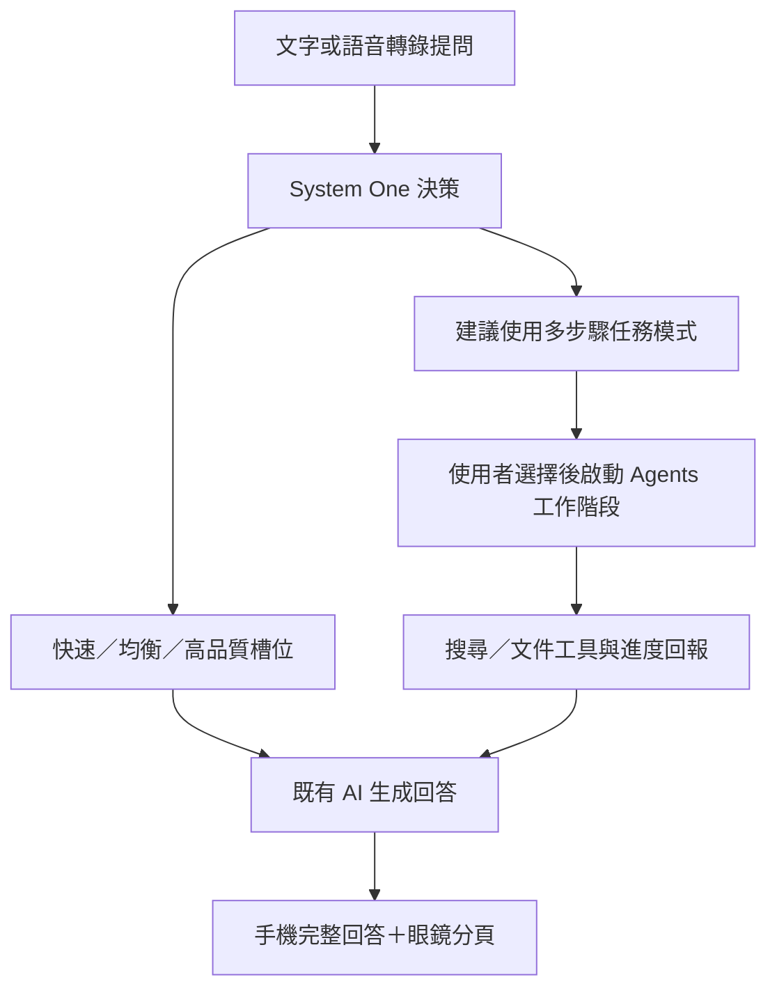

# System One 與 Agents API 整合評估

研究日期：2026-10-01（Asia/Taipei）。本文件保留方案研究；後續已依使用者同意範圍加入 Gemini／OpenAI 決策並執行實機 API 測試，結果見 [實機測試](DEVICE_SMOKE_TEST.md)。Agents 尚未實作。

## 使用者最新條件

- 使用者在手機更換 Gemini 金鑰後，Gemini 對話、決策與照片分析成功；OpenAI 對話與決策亦通過手機端 API 測試。沒有擷取舊金鑰，因此不推論舊金鑰失敗的確切原因。
- 沒有準備 Laya 服務網址；保留現有設定入口，暫不把 Laya 列入已可實測的後端。
- 使用者允許辦公室拍攝；本次 SPP 拍照傳輸及 Gemini 分析成功。
- 手機預覽效果沒有指定偏好；建議依眼鏡回報的實際畫面尺寸與排版規則製作預覽。

## 查證結果

| 方案 | 能力與 App 用途 |
| --- | --- |
| TypeSafe Jev | 結構化決策：選項、分數、機率。適合選快速／均衡／高品質模型；生成回答交給既有 AI 服務。需 TypeSafe 憑證。[API 文件](https://docs.typesafe.ai/api) |
| Laya | 可自架 Jev 相容 HTTP 服務；Node 版是 ONNX 函式庫，不能直接當 Android 套件使用。[Node 專案](https://github.com/receptron/laya)、[模型與 HTTP 服務](https://huggingface.co/convaiinnovations/laya) |
| LLM System One Adapter | TypeSafe 官方開源介面可使用 OpenAI／Gemini 等 LLM 做相同形狀的決策。Python 版本供參考與評估；Android 要實作對應介面或另設服務。不能因此把 LLM 自報機率當成 Jev 同等校準的機率。[官方 Adapter](https://github.com/typesafe-ai/system-one-adapter-python) |
| OpenAI Agents API | 託管持久工作階段、工具協調、上下文壓縮與復原；適合需要搜尋、檔案或多個步驟的任務。費用含模型、工具及使用的託管容器。[官方概覽](https://developers.openai.com/api/docs/guides/agents-api/overview) |

Laya 作者明確指出基礎模型在部分決策測試的零樣本表現有限，應用自己的資料微調、校準；繁中需多語模型。GPU／Apple CPU 的公開速度不能視為這台手機或台灣網路的實測值。[模型限制](https://huggingface.co/convaiinnovations/laya#honest-limits)

System One 的輸出符合格式，不代表難度分類一定正確。信心門檻需依實際資料與錯誤代價驗證。[TypeSafe 信心說明](https://docs.typesafe.ai/confidence)

## 後續 Agents 架構建議

此圖是設計建議，不是目前程式已具備的流程。現有 `DecisionRouter` 只判斷難度、選槽位與備援，沒有 Agents 工作階段。

- 一般問答沿用現有槽位；高難度不必然需要 Agents，例如數學推理可能只需高品質模型。
- 未來應分開判斷「回答難度」與「是否需要搜尋／多步驟工具」，提供有限選項。
- Agents 第一階段可只接搜尋與使用者提供的文件；相機、錄音與外部寫入維持使用者確認後執行的規則。
- 方案建議由應用後端管理 Agents 工作階段與工具回傳，App 顯示進度、取消、繼續與結果；Agents API 本身不會自動連到手機或眼鏡硬體。
- Jev、Laya、LLM Adapter 的品質／延遲／信心分開評估，不共用未經驗證的校準假設。

## 修正與驗證順序

1. **查 401：**檢查手機實際讀取的供應商設定、設定變更後服務更新、請求端點／驗證方式、選中槽位及備援順序。只記錄供應商、模型、HTTP 狀態與可辨識的錯誤類別；不記錄金鑰。用相同有效設定核對 App 路徑。
2. **修預覽：**眼鏡連線時回報畫面尺寸；手機採相同比例、字形、字級倍率及狀態／主文／提示的區域分配。未連線時採最近尺寸或清楚標示示意比例。驗證大字級、小範圍不重疊。
3. **查相機連線：**釐清 SPP 與 CXR BLE 各自狀態、裝置識別與重試原因；利用既有成功拍照流程比對，在指定辦公室場景做實測。不能以 SPP 成功代替相機成功。
4. **驗決策：**建立專案情境的繁中／英文測例，分別量難度判斷、錯分到快速模型、延遲與備援；另檢查跨模型對話脈絡。
5. **Agents 試作：**只有選定具體用途後才加入小範圍流程；先驗工作階段、進度、取消與結果，再擴大工具。

## 使用者已確認的初期範圍

- 初期決策後端加入既有 Gemini／OpenAI，使用手機內現有供應商金鑰；Jev／Laya 保留可切換。
- Agents 暫緩，先完成 App 修正與實機驗證。尚未指定 Agents 的具體第一個用途。
- 手機與眼鏡皆已連上 ADB；使用者允許在辦公室場景拍照測試。

研究本身沒有證實目前 401、CXR BLE 的根因，也沒有證實帳號能成功建立 Agents 工作階段。實機結果另記錄於 DEVICE_SMOKE_TEST.md。
